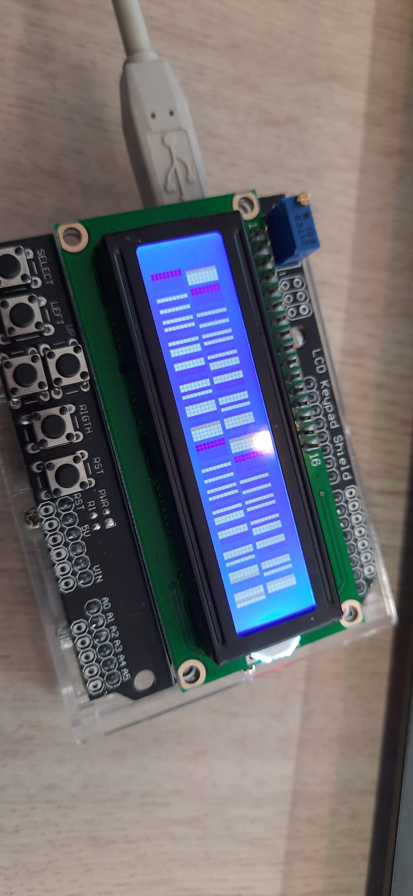

# LCD with Buttons

 

## Parts:
* Arduino UNO (or any that fits a LCD)
* Any LCD

## Setup:
1. Attach the LCD to the arduino
1. Change the settings in settings.h
    * `LCD_COLS` to the amount of columns your display has
    * `LCD_ROWS` to the amount of rows your display has
    * `LCD_RS`, `LCD_EN`, `LCD_D4`, `LCD_D5`, `LCD_D6`, `LCD_D7` and `LCD_BUTTONS` to the correct pins
1. Upload the sketch
1. Watch the test
